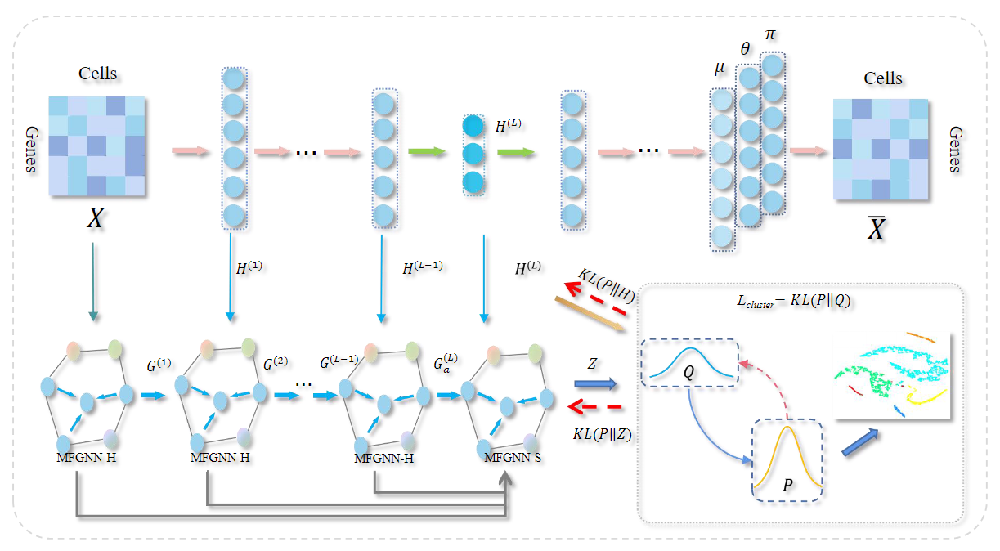

# scMFGNN
we proposed scMFGNN, a single-cell clustering model based on a deep graph embedding method, which dynamically fuses representation of scRNA-seq data from different multi-scale layers, and adaptively concatenate topological structural information and node attribute information in the same layer. Moreover, scMFGNN employs a ZINB-based autoencoder to overcome high-dispersion issues in clustering scRNA-seq data. The scMFGNN outperforms state-of-the-art scRNA-seq data clustering methods in terms of clustering accuracy on nine datasets. It is able to obtain the code for our work at https://github.com/youngcmm/scMFGNN.

* You can configure the environment using requirements.txt.

* Once we've gathered the scRNA-seq data, the next step involves performing preliminary processing on the gene expression data. Following preprocessing, the processed data is stored in the designated data directory using the scanpyFilter.py. As GitHub space is limited, we are unable to host the complete dataset there. For access to the detailed data file, please download it from the provided link: https://support.10xgenomics.com/single-cell-gene-expression/datasets/2.1.0/pbmc4k."

* Generate graphs. We execute the calcuGraph.py file, generate the graph required for input, and store it in the date folder.

* Pretraining. In order to obtain better training results, we undertook a pretraining phase. This involved running the pretrain.py script to generate a pretraining model, saved as a .pkl file.

* Training. Run the scMFGNN.py file to train the final model.

